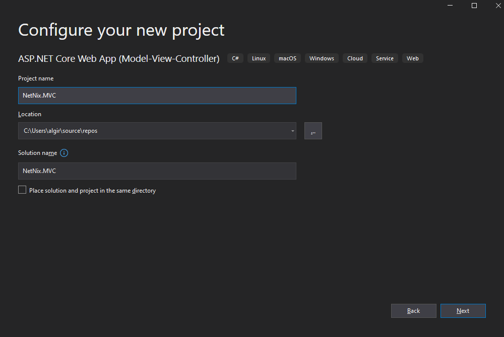
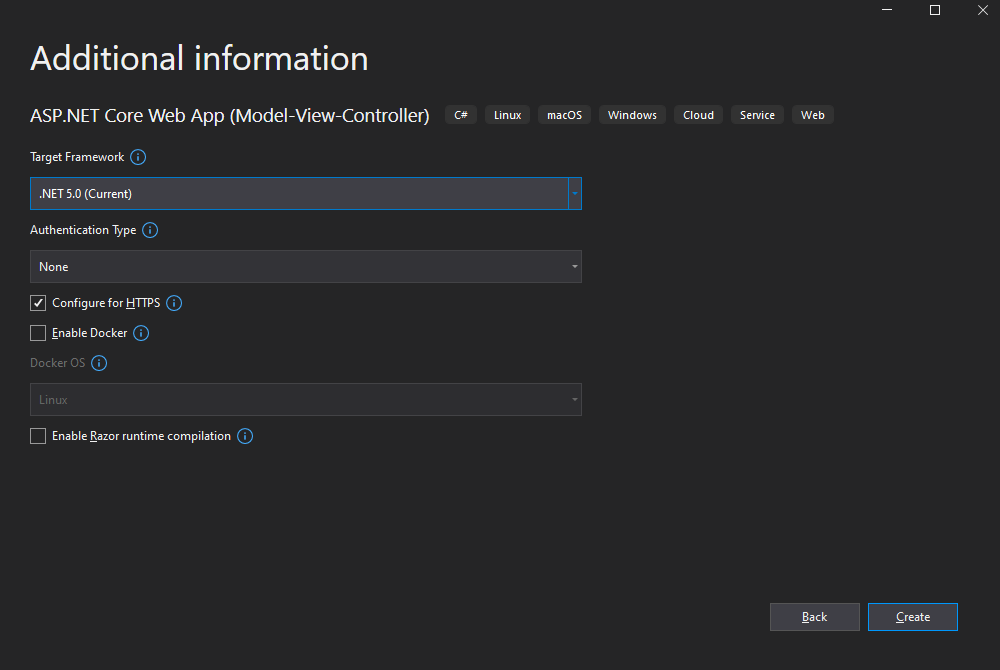

# NetNix.MVC
Application created using ASP.NET Core (Model-View-Controller) template, provided by Visual Studio 2019:

## HttpClient
To call NetNix API I injected HttpClient into Startup.cs Dependency Injection container and used my own IMovieService interface that I injected into HomeController.
MovieService.cs(implementation class) holds all methods to consume NetNix API. After observing https://app.swaggerhub.com/apis-docs/BartvdPost/NetNix/0.2.0#/likes OpenAPI I configured the necessary Validations to match those in the swagger. For that I used FluentValidation NuGet package. This package can be used on all type of models: 
- Ex: DataBase EntityModel/
- DataTransferModel 
- ViewModel. 
###Good practices requires not to use Validation Attributes on EntityModels esspecially. So such package comes in with great solution to this issue.
